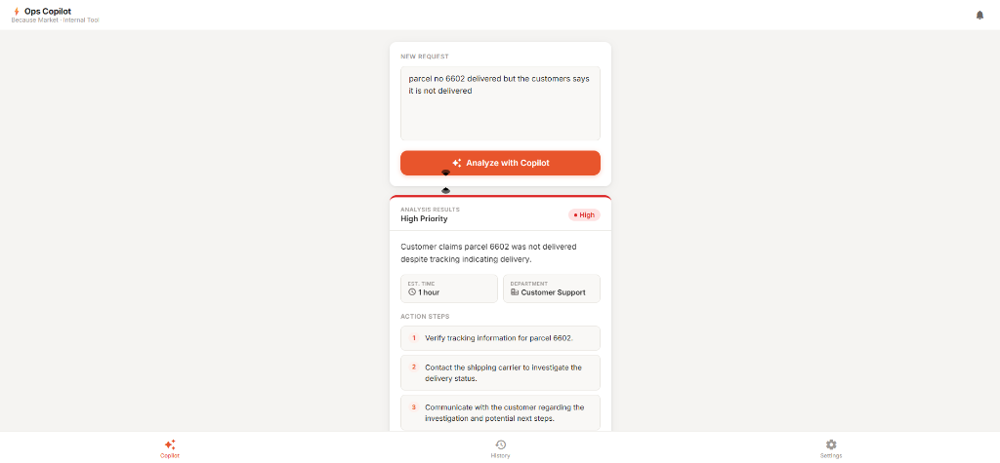
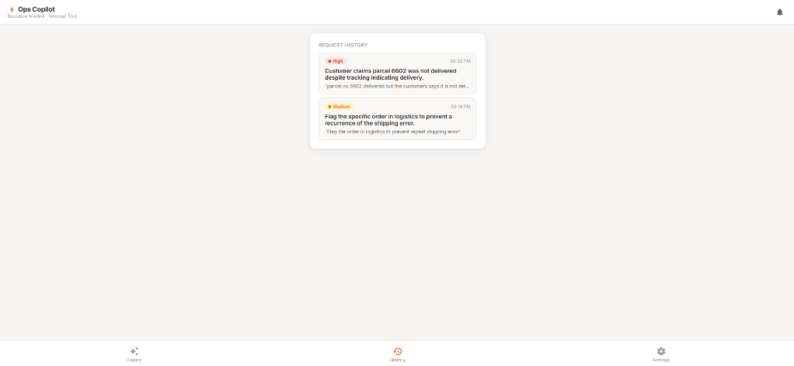

# Because Market — Ops Copilot ⚡

A premium Internal Operations Tool designed for **Because Market**. This AI-powered assistant takes messy internal requests, customer complaints, or support tickets and instantly transforms them into structured, actionable insights using Google's **Gemini 2.5 Flash** model.



## 🌐 Live Demo
Access the production app here: **[op-assistant-production.up.railway.app](https://op-assistant-production.up.railway.app/)**

## ✨ Features

- **Instant Analysis**: Converts unstructured text into structured JSON with priority, summary, and action steps.
- **Priority Detection**: Automatically flags issues as High, Medium, or Low with dynamic color-coded UI.
- **Smart History**: Local persistence of previous analyses for quick reference.
- **Premium UI/UX**: Designed with Stitch, featuring smooth animations, glassmorphism, and a sleek dark mode.
- **Secure Configuration**: User-provided API keys are stored safely in local storage (never on the server).
- **Mobile Responsive**: Fully optimized for both desktop and mobile operations.

## 🛠️ Tech Stack

- **Backend**: Flask (Python)
- **AI**: Google GenAI SDK (Gemini 2.5 Flash)
- **Frontend**: Vanilla HTML5, CSS3, JavaScript
- **Deployment**: Optimized for Railway

## 🚀 Getting Started

### Prerequisites
- Python 3.9+
- A Google Gemini API Key ([Get one here](https://aistudio.google.com/app/apikey))

### Local Installation
1. **Clone the repository**:
   ```bash
   git clone https://github.com/krtanay/Op-Assistant.git
   cd Op-Assistant
   ```

2. **Setup Virtual Environment**:
   ```bash
   python -m venv venv
   source venv/bin/activate  # On Windows: venv\Scripts\activate
   ```

3. **Install Dependencies**:
   ```bash
   pip install -r requirements.txt
   ```

4. **Environment Variables**:
   Create a `.env` file in the root directory:
   ```env
   GEMINI_API_KEY=your_key_here
   ```

5. **Run the App**:
   ```bash
   python app.py
   ```
   Visit `http://localhost:5000` in your browser.

## 📸 Screenshots

### 🚀 Analysis Workflow
| Analyzing a Request | Structured Output |
| :--- | :--- |
|  |  |

### 🕒 Activity & Settings
| History Tracking | Secure Configuration |
| :--- | :--- |
|  |  |

---
*Built for Because Market Operations Efficiency.*
