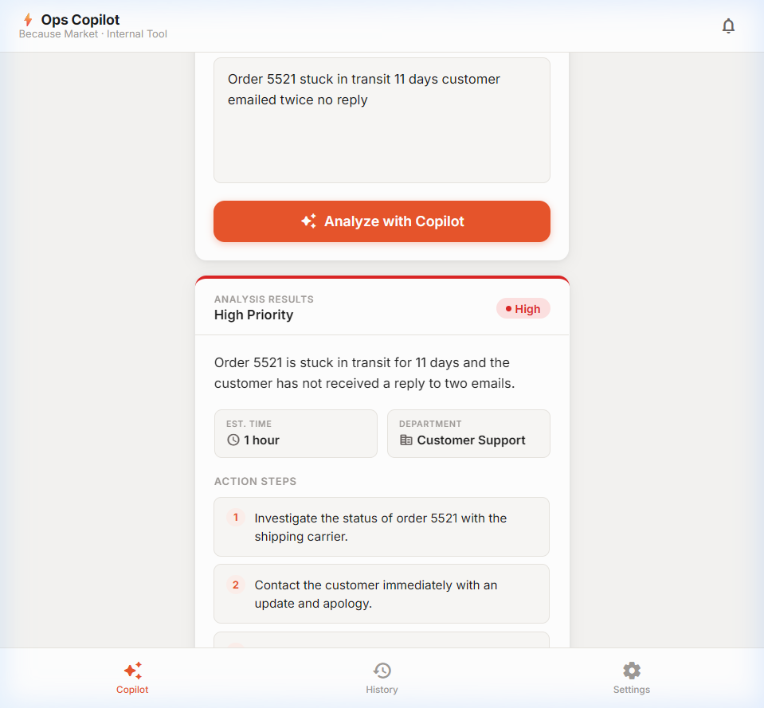
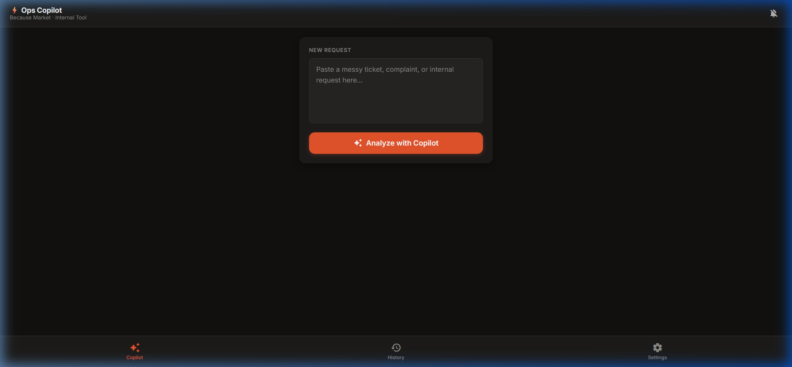
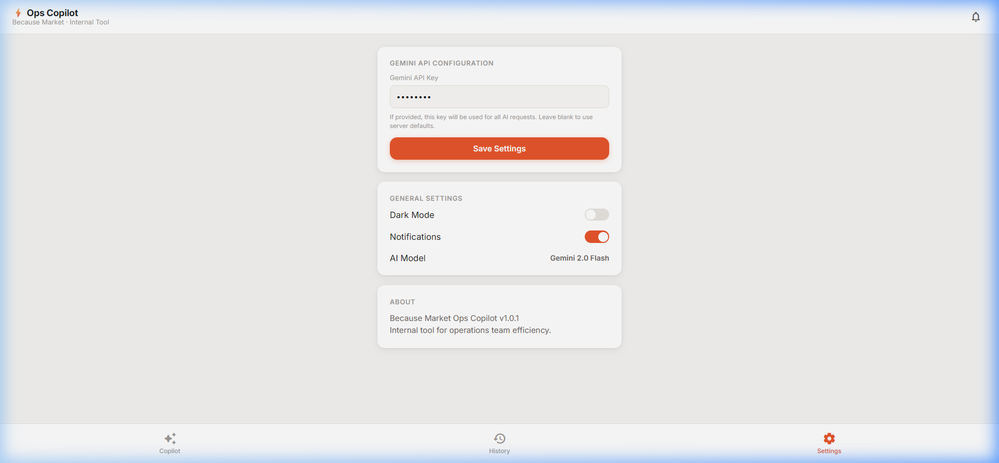

<div align="center">

# ⚡ Because Market — Ops Copilot

**An AI-powered internal operations assistant that transforms messy tickets, customer complaints, and internal requests into structured, actionable plans — in seconds.**

Built with **Flask** + **Google Gemini 2.0 Flash Lite** | Designed for the Because Market ops team


</div>

---

## 📸 Screenshots

### 🔍 Submitting a Request
<p align="center">
  
</p>

*Paste any messy ticket or complaint into the text area and click Analyze.*

---

### ✅ AI Analysis Results — High Priority
<p align="center">
  
</p>

*The app returns a structured JSON response with priority level, summary, estimated time, department, and numbered action steps — all rendered beautifully in the UI.*

---

### 🌙 Dark Mode
<p align="center">
  
</p>

*Full dark mode support — toggled in Settings and persisted in localStorage.*

---

### ⚙️ Settings Panel
<p align="center">
  
</p>

*Users can configure their own Gemini API key, toggle dark mode, and manage notification preferences — all saved locally.*

---

## 🚀 Features

| Feature | Details |
|---|---|
| 🤖 **AI Triage** | Converts chaotic tickets into structured JSON using Gemini |
| 🎨 **Beautiful UI** | Mobile-first design with smooth animations |
| 🌙 **Dark Mode** | One-click toggle, persisted across sessions |
| 🔑 **Custom API Key** | Users enter their own Gemini key in Settings |
| 📋 **Request History** | Last 20 analyses saved in localStorage — clickable to replay |
| ⚡ **Response Cache** | In-memory cache prevents duplicate API calls |
| 🛡️ **Smart Error Handling** | Clear messages for quota errors, auth failures, and network issues |
| ⌨️ **Keyboard Shortcut** | `Ctrl/Cmd + Enter` triggers analysis instantly |

---

## 🧠 How It Works

```
User Input (messy ticket)
        ↓
Flask /process endpoint
        ↓
Check in-memory cache → if hit, return immediately
        ↓
Build prompt: System Instruction + 1 Few-Shot Example + User Input
        ↓
Google Gemini 2.0 Flash Lite (non-streaming)
        ↓
Parse & validate JSON response
        ↓
Return structured result → Frontend renders with animations
```

### AI Prompt Design
- **System instruction**: Role-primed as a Because Market ops assistant with strict JSON-only output rules
- **Few-shot example**: 1 high-quality example (reduced from 3) to guide the model
- **Response schema**: `priority`, `summary`, `action_steps[]`, `estimated_time`, `department`
- **Token budget**: max 150 output tokens (our JSON never needs more)

---

## 📁 Project Structure

```
op-assi/
├── app.py                  # Flask backend — routes, Gemini API, caching
├── templates/
│   └── index.html          # Single-page app — all HTML, CSS, JS
├── requirements.txt        # Python dependencies
├── .env.example            # Template for environment variables
├── screenshots/            # UI screenshots for documentation
│   ├── analysis_result.png
│   ├── dark_mode.png
│   └── settings.png
└── README.md
```

---

## 🛠️ Local Setup

### 1. Clone the repo

```bash
git clone git@github.com:krtanay/Op-Assistant.git
cd Op-Assistant
```

### 2. Create a virtual environment

```bash
python -m venv .venv

# Windows
.venv\Scripts\activate

# macOS/Linux
source .venv/bin/activate
```

### 3. Install dependencies

```bash
pip install -r requirements.txt
```

### 4. Configure your Gemini API key

```bash
# Copy the template
cp .env.example .env

# Edit .env and add your key
GEMINI_API_KEY=AIza...your_key_here
```

> **Get a free key**: [aistudio.google.com](https://aistudio.google.com/) → Get API Key

### 5. Run the app

```bash
python app.py
```

Open your browser at **[http://127.0.0.1:5000](http://127.0.0.1:5000)** 🎉

---

## 🔑 API Key — Two Ways to Configure

| Method | How |
|---|---|
| **Server-side** (default) | Set `GEMINI_API_KEY` in your `.env` file |
| **User-side** (for deployment) | Open the app → Settings → paste your key → Save |

The user-side key is stored in the browser's `localStorage` and sent with every request. It takes priority over the server-side key. This means **deployed users can bring their own key** without touching the server.

---

## 🌐 Deployment

### Deploy to Railway / Render / Fly.io

1. Set the environment variable `GEMINI_API_KEY` in your platform's dashboard
2. Set the start command to: `python app.py`
3. Done — no build step needed

### Example for Railway

```bash
# Set environment variable in Railway dashboard:
GEMINI_API_KEY=AIza...
```

> **Tip**: Even without a server-side key, users can paste their own Gemini key in the Settings tab.

---

## 📊 Token Optimization

This app is optimized to minimize Gemini API usage and stay within free-tier limits:

| Metric | Before | After |
|---|---|---|
| Few-shot examples | 3 | 1 |
| Max output tokens | 1024 | 150 |
| API call mode | Streaming | Non-streaming (single call) |
| Caching | None | In-memory response cache |
| **Est. tokens/request** | ~405 | ~240 |
| **Reduction** | — | **~40%** |

---

## 🧩 Tech Stack

| Layer | Technology |
|---|---|
| Backend | Python 3.11, Flask 3.x |
| AI | Google Gemini 2.0 Flash Lite via `google-genai` SDK |
| Frontend | Vanilla HTML/CSS/JS (no framework) |
| Fonts & Icons | Google Fonts (Inter) + Material Icons Round |
| Storage | Browser `localStorage` (history, settings, API key) |

---

## 📋 Example Input / Output

**Input** (messy ticket):
```
customer called very upset wrong product arrived needs refund maybe idk urgent
```

**Output** (structured JSON):
```json
{
  "priority": "High",
  "summary": "Customer received the wrong product and is requesting an urgent refund.",
  "action_steps": [
    "Verify the customer's order details.",
    "Issue a refund immediately.",
    "Apologize and follow up with the customer."
  ],
  "estimated_time": "30 minutes",
  "department": "Customer Support"
}
```

---

## ⚠️ API Quota Notes

If you see a **429 RESOURCE_EXHAUSTED** error:
- The free tier allows limited requests per minute/day
- Wait ~60 seconds and try again
- Or [enable billing](https://console.cloud.google.com/billing) on your Google Cloud project for higher quotas
- Users can also enter their own API key in the Settings tab

---

## 📄 License

MIT — free to use, modify, and distribute.

---

<div align="center">
  Built with ❤️ for Because Market by <a href="https://github.com/krtanay">@krtanay</a>
</div>
