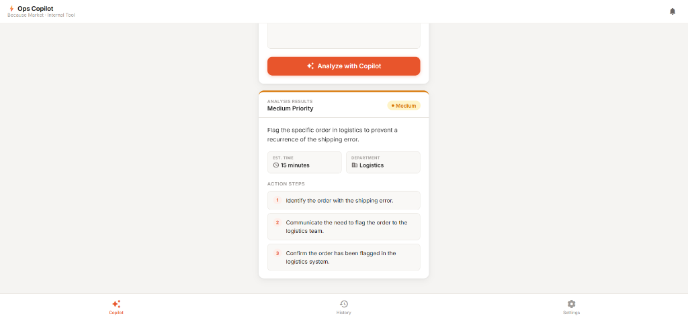
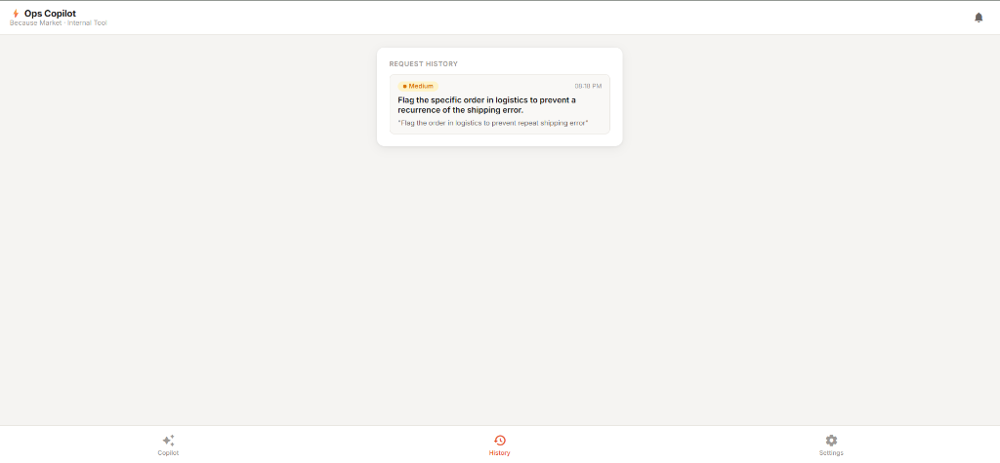

# ⚡ Ops Copilot — Because Market Internal Tool

**Ops Copilot** is a high-performance internal operations assistant designed to transform chaotic internal requests, customer complaints, and support tickets into structured, actionable JSON data in milliseconds.

Built specifically for the **Because Market** operations team, it bridges the gap between messy human communication and structured operational workflows.

---

## 🚀 Key Features

- **🤖 AI-Powered Triage**: Uses the cutting-edge **Google Gemini 2.5 Flash** model for lightning-fast, high-accuracy analysis.
- **📊 Structured Output**: Every request is converted into a structured plan containing:
  - **Priority Level** (High/Medium/Low)
  - **Single-sentence Summary**
  - **Step-by-step Action Plan**
  - **Estimated Completion Time**
  - **Department Routing** (Logistics, Support, Marketing, etc.)
- **📋 Analysis History**: Automatically saves the last 20 requests and their results in browser storage for instant recall.
- **🔑 Bring Your Own Key**: Architected for privacy and easy deployment; users securely input their own Gemini API key via the settings panel.
- **🌙 Premium UI/UX**: Feature-rich single-page application (SPA) with smooth animations, mobile-first responsiveness, and a beautiful dark mode.
- **🛡️ Production Grade**: Robust error handling with automatic exponential backoff retries (via `tenacity`) to handle quota limits gracefully.

---

## 📸 Visual Walkthrough

### 🔍 Intelligent Analysis
Paste any messy ticket or internal request. The Copilot analyzes the urgency and creates a structural roadmap for resolution.

<p align="center">
  
</p>

### 🕒 Request History
Keep track of your workflow. Clicking any history item instantly replays the analysis result without needing a new API call.

<p align="center">
  
</p>

---

## 🧠 The Tech Stack & Architecture

### Core Engine: Google Gemini 2.5 Flash
I chose **Gemini 2.5 Flash** as the primary intelligence engine because it provides the perfect balance of massive context window speed and cost-effectiveness. 

### How It Was Built:
1.  **Backend (Python/Flask)**: A lightweight REST API handles request processing, in-memory caching for faster responses, and secure API key management.
2.  **Frontend (Vanilla HTML/CSS/JS)**: I avoided heavy frameworks to ensure the app loads instantly. The UI uses modern CSS HSL variables for a sleek, premium design system.
3.  **Few-Shot Prompt Engineering**: The model is primed with specific "Because Market" operational context and strictly constrained to return valid JSON, preventing "AI hallucination" or extra conversational text.
4.  **Robustness (Tenacity Integration)**: To combat API quota limits (429 errors), I implemented a retry system that waits and tries again automatically before the user even sees an error.
5.  **Browser Storage**: Uses `localStorage` to persist a user's API key, theme preference (Dark/Light), and history across sessions without needing a database.

---

## 🛠️ Quick Start

1.  **Clone & Install**:
    ```bash
    git clone https://github.com/krtanay/Op-Assistant.git
    cd Op-Assistant
    pip install -r requirements.txt
    ```

2.  **Run**:
    ```bash
    python app.py
    ```

3.  **Setup API Key**:
    - Open the app in your browser (`localhost:5000`).
    - Navigate to the **Settings** tab.
    - Paste your **Gemini API Key**. (Get one free at [Google AI Studio](https://aistudio.google.com/)).
    - Click **Save**.

---

<div align="center">
  Built with ❤️ for Because Market by <a href="https://github.com/krtanay">@krtanay</a>
</div>
